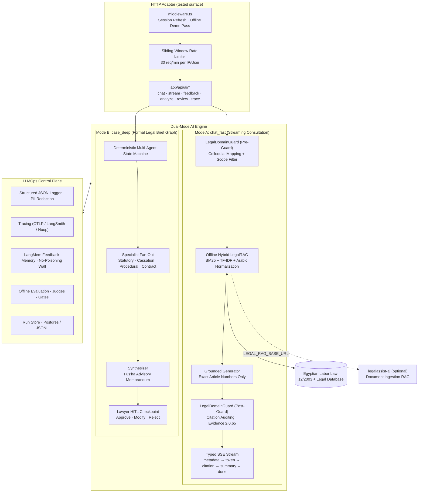

# Arabic-law-RAG — Egyptian Legal AI Stack & RAG Engine

<div align="center">

### محرك الذكاء الاصطناعي والاسترجاع القانوني المصري
**Offline-first, dual-mode legal AI: hybrid Arabic retrieval, anti-hallucination guards, multi-agent case drafting, and an evaluation-gated LLMOps control plane.**

[](https://www.typescript.org/)
[](https://vitest.dev/)
[-green)](./evaluation)
[](#-offline-first-architecture)

[English](#system-overview) • [Architecture](#-high-level-system-architecture) • [Quickstart](#-quickstart) • [Evaluation](#-evaluation--verification) • [Python sidecar](#-python-sidecar-legalassist-ai) • [Provenance](#-provenance)

</div>

---

## System Overview

This repository contains a sovereign, offline-first AI engine for Egyptian law: a zero-hallucination legal retrieval and generation stack. It provides an evaluation-verified hybrid retrieval engine (BM25 + TF-IDF + Arabic normalization over codified statutes), a typed Server-Sent Events consultation protocol, a deterministic multi-agent case-brief graph with lawyer Human-In-The-Loop (HITL) review, and a production-grade LLMOps observability and evaluation layer.

The web application (pages, components, practice-management CRUD APIs) is **not** part of this repository. The AI HTTP surface (`app/api/ai/*`) and the session middleware are included because they are the tested adapter boundary for the engine.

### What is included

| Area | Path | Contents |
| --- | --- | --- |
| RAG engine | `lib/ai/legalRag.ts` | Arabic normalization, tokenization, colloquial synonyms, hybrid local retrieval, citation verification, optional remote RAG |
| Legal guard | `lib/ai/safety/legalGuard.ts` | Pre-execution domain classification, colloquial mapping, post-execution citation auditing, evidence thresholds |
| Generation | `lib/ai/generation/grounded.ts` | Grounded answers and structured case summaries |
| Multi-agent graph | `lib/ai/agents/` | Deterministic specialist fan-out, synthesizer, HITL checkpoint store |
| Corpus | `lib/ai/knowledge/egyptian-labor-law.json`, `lib/data/legalData.ts` | Egyptian Labor Law 12/2003 (46 structured articles) plus a curated multi-domain legal database |
| LLMOps | `lib/llmops/` | Structured logging with PII redaction, OTLP/LangSmith tracing, metrics, run store, LangMem feedback memory, evaluators, judges, quality gates, retention |
| HTTP surface | `app/api/ai/*`, `middleware.ts` | Chat, SSE stream, feedback, case analyze/review, trace, match, research, summarize; session refresh and offline demo fallback |
| Evaluation | `evaluation/` | 57-scenario legal suite, 16-scenario smoke suite, baselines, committed reports |
| Tests | `tests/` | 16 Vitest files covering the AI and LLMOps surface (196 tests) |
| Python sidecar | `legalassist-ai/` | Local document ingestion and RAG (FAISS + BM25 + RRF + reranker + Ollama), FastAPI service, 4 unit tests, packaging review |
| Documentation | `docs/`, `.memory/` | Architecture deep dives, ADRs 010–012, LLMOps operator guide, runbook, review-board challenges, known constraints, technical debt |

### What is excluded

- All web pages, React components, and branding assets.
- Practice-management APIs (`cases`, `clients`, `documents`, `invoices`, `lawyers`, `time-entries`) and their migrations, tests, and server actions.
- Authentication UI, validation schemas, and client-side Supabase SDK.
- The Python Streamlit UI (`legalassist-ai/ui`).
- Archify harness output (`docs/visuals/*.visual-check.html`) and superseded duplicate evaluation reports.

---

## High-Level System Architecture



---

## Offline-First Architecture

All core capabilities run without external cloud dependencies:

- **Retrieval:** in-process hybrid search over codified statutes; no embedding service required.
- **Generation:** deterministic grounded synthesis from retrieved chunks; no LLM call is required for the core path.
- **Stores:** Supabase when configured, local append-only JSONL under `.llmops/` otherwise.
- **Observability:** structured JSON logs to stdout, optional OTLP or LangSmith export.
- **Evaluation:** fully offline rule-based scorers; the LLM-as-judge is optional and skipped without `GROQ_API_KEY`.

The `LEGAL_RAG_BASE_URL` path is the only optional remote dependency; when it is unset or unreachable, retrieval falls back to the local hybrid engine.

---

## Quickstart

### Prerequisites

- Node.js 20+
- (Optional) Python 3.11+ and Ollama for the document-ingestion sidecar

### Install and verify

```bash
git clone https://github.com/myler71/Arabic-law-RAG.git
cd Arabic-law-RAG
npm install
npm run typecheck
npm test
```

### Environment

```bash
cp .env.example .env.local
```

Every variable is optional. Without Supabase credentials the routes run in offline demo mode and return the `x-arabic-law-rag-demo-mode: 1` header. See `.env.example` for the full list (Supabase, Ollama, Groq judge, OTLP, LangSmith, feature flags).

### Evaluation

```bash
npm run eval          # 57-scenario Egyptian legal offline suite
npm run eval:smoke    # 16-scenario smoke gate used in CI
npm run eval:compare  # regression comparison against the committed baseline
```

### Evaluation thresholds

| Metric | Target |
| --- | --- |
| Out-of-domain block rate | 100% |
| Retrieval Recall@5 | ≥ 80% |
| Citation verification rate | ≥ 98% |
| Fabricated citations | 0 |
| Domain classification accuracy | ≥ 95% |
| TTFT | warn > 800 ms, fail > 3000 ms |

See [`evaluation/README.md`](./evaluation/README.md) for metric definitions and [`docs/llmops.md`](./docs/llmops.md) for the telemetry catalog.

---

## Python Sidecar (`legalassist-ai/`)

A local-first Arabic legal document intelligence service: PDF/DOCX/TXT/MD parsing, Arabic NER and legal information extraction, FAISS + BM25 hybrid retrieval with reciprocal-rank fusion and a local reranker, grounded chat with page/clause citations, conservative risk flags, and contract version comparison. LLM inference runs through Ollama (default `qwen3:8b`); embeddings default to `BAAI/bge-m3`.

```bash
cd legalassist-ai
python -m venv .venv && .\.venv\Scripts\Activate.ps1   # Windows
pip install -r requirements.txt
python -m pytest -q                                     # 4 unit tests
uvicorn app.api.main:app --host 127.0.0.1 --port 8000   # or run_api.bat
```

**Known contract gap:** `lib/ai/legalRag.ts` posts to `POST {LEGAL_RAG_BASE_URL}/api/search` when `LEGAL_RAG_BASE_URL` is set. The FastAPI app does not expose `/api/search` (it exposes `/documents`, `/chat`, `/analyze`, `/compare`, `/health`). Until that endpoint is added, the remote RAG path silently falls back to the local hybrid engine. This gap is carried over from the source repository and is not fixed in this extraction.

**Packaging review:** see [`legalassist-ai/REVIEW.md`](./legalassist-ai/REVIEW.md) for what was and was not executed at packaging time (end-to-end Ollama inference and OCR were not run in the build container).

---

## Supabase Migrations (optional)

`supabase/migrations/20260915000000_llmops_runs_feedback.sql` and `20260915000001_llmops_memory.sql` create the optional `ai_runs`, `ai_feedback`, `ai_memory_items`, and `ai_eval_cases` tables with row-level security. They reference `auth.users`, `public.profiles`, and `public.cases`, which live in the practice-management schema of the host application and are **not** part of this repository, so they apply only inside a Supabase project that already defines those tables. **The supported standalone persistence is the JSONL fallback** under `.llmops/`, which is what the test suite exercises.

**Dependency advisory (carried over from the source):** `npm audit` reports a high-severity advisory in the `postcss` version bundled with `next@15.x` (XSS via unescaped `</style>` in CSS stringify output, and file disclosure via attacker-controlled `sourceMappingURL`; see GHSA-qx2v-qp2m-jg93, GHSA-6g55-p6wh-862q). The remediation is a breaking upgrade to `next@16.3.6+`, which is out of scope for this extraction and was not applied. Exposure in this repository is limited to build-time CSS tooling: there is no CSS pipeline, no pages, and no attacker-controlled stylesheet input. Consumers deploying these routes inside a Next.js application should upgrade Next.js to a patched version.

`tsx` and `esbuild` (a transitive dev dependency) run install scripts during `npm install`; they are required only for the evaluation CLIs.

**Python dependency pinning:** `legalassist-ai/requirements.txt` uses lower-bound ranges (`>=`) with no upper bounds, as in the source repository. For reproducible or hardened deployments, pin exact versions or add a constraints file after auditing the transitive set (torch, transformers, and sentence-transformers pull large transitive trees).

**Telemetry egress:** logging writes one JSON line per event to stdout; trace and metric export is opt-in via `OTLP_ENDPOINT` (default `http://localhost:4318`) or `LANGSMITH_API_KEY` (default project `arabic-law-rag-dev`). With neither configured, no data leaves the process. If you enable LangSmith or a remote OTLP endpoint, legal queries and retrieval metadata will be sent to that service.

---

## Documentation Index

Explore the comprehensive design and architectural documentation located in [`/docs`](./docs):

- [**Deep AI Systems Engineering & Architecture Report**](./docs/AI_ENGINEERING_DEEP_TECHNICAL_REPORT.md) — Comprehensive technical report detailing all folders, files, functions, the multi-agent state machine, RAG mathematics, LangMem memory tiers, Arabic NLP engineering, and the LLMOps control plane.
- [**Visual Architecture Deep Dive**](./docs/ARCHITECTURE_DEEP_DIVE.md) — Detailed Mermaid diagrams covering the data journey from ingestion to observability.
- [**Interactive Visualizations (HTML)**](./docs/visuals/) — Standalone interactive architecture diagrams:
  - [AI Architecture Map](./docs/visuals/arabic-law-rag-ai-architecture.html)
  - [AI Stack Topology](./docs/visuals/arabic-law-rag-ai-stack.html)
  - [AI Data Flow Engine](./docs/visuals/arabic-law-rag-ai-dataflow.html)
  - [AI Consultation Sequence](./docs/visuals/arabic-law-rag-ai-sequence.html)
  - [AI Runtime Lifecycle](./docs/visuals/arabic-law-rag-ai-lifecycle.html)
  - [Multi-Agent Deep Workflow](./docs/visuals/arabic-law-rag-deep-workflow.html)
- [**Full Implementation Session Recap**](./docs/SESSION_RECAP_2026-09-15.md) — Line-by-line verification log, bugs diagnosed, and phase milestones.
- [**LLMOps Operator Guide**](./docs/llmops.md) — Telemetry dictionary, logging envelopes, metrics catalog, and retention schedules.
- [**Operations & Incident Runbook**](./docs/runbook.md) — Deployment instructions, key rotation, and troubleshooting playbooks.
- [**Review Board Challenges & Decisions**](./docs/challenges.md) — Active architectural audits and technical trade-off decisions.
- [**Technical Debt Register**](./.memory/technical_debt.md) — Tracked technical debt entries with assigned owners and resolution targets.

### Architecture Decision Records

| ADR | Decision |
| --- | --- |
| [`docs/adr/010-llmops-stack.md`](./docs/adr/010-llmops-stack.md) | LLMOps stack selection (OpenTelemetry-optional, LangSmith-optional, native LangMem) |
| [`docs/adr/011-langmem-feedback.md`](./docs/adr/011-langmem-feedback.md) | Native LangMem-compatible feedback memory store and the no-poisoning invariant |
| [`docs/adr/012-eval-gates-ci.md`](./docs/adr/012-eval-gates-ci.md) | Evaluation quality gates enforced in CI |

### Additional Context

| Document | Contents |
| --- | --- |
| [`.memory/known_constraints.md`](./.memory/known_constraints.md) | Ground-truth architectural invariants (never fabricate law, offline-first, Secure-0) |
| [`.memory/architecture_decisions.md`](./.memory/architecture_decisions.md) | ADR index (ADR-001 through ADR-004) |
| [`evaluation/README.md`](./evaluation/README.md) | Offline evaluation suite: metric definitions, thresholds, and report format |
| [`legalassist-ai/REVIEW.md`](./legalassist-ai/REVIEW.md) | Python sidecar packaging review: what was verified and what was not executed |
| [`docs/superpowers/specs/`](./docs/superpowers/specs/) | Extraction design spec: inclusion boundary, caveats, verification gates |

---

## Provenance

This repository is a **single-commit extraction** of an AI stack and RAG engine that was originally developed inside a larger Egyptian legal-practice application, authored by **Marwan Ammar (myler71)**.

- The source application is unmodified; this repository carries no history from other contributors. The AI engine, RAG system, LLMOps control plane, and evaluation suite here were authored by Marwan Ammar.
- The extraction design and boundary decisions are recorded in [`docs/superpowers/specs/2026-09-24-arabic-law-rag-extraction-design.md`](./docs/superpowers/specs/2026-09-24-arabic-law-rag-extraction-design.md).
- Documented debt and caveats carried over from the source are listed in the design spec, including the Python `/api/search` gap and migration prerequisites.

---

## Legal Disclaimer

This is an AI decision-support engine for Egyptian legal research. It does not provide formal legal representation and does not substitute for counsel admitted to the Egyptian Bar Association. All generated briefs and memoranda must undergo mandatory Human-In-The-Loop review by a licensed practitioner before filing.

## License

MIT
