# Arabic Law RAG AI Stack — Architecture & Design Deep Dive
**Companion to:** `docs/SESSION_RECAP_2026-09-15.md`
**Format:** Mermaid diagrams + stage-by-stage specifications
**Scope:** The complete data journey — upload → parse → index → retrieve → guard → generate → stream → feedback → memory → evaluate → observe → improve (the closed iteration loop)

---

## 0. The One Picture — Full System Topology

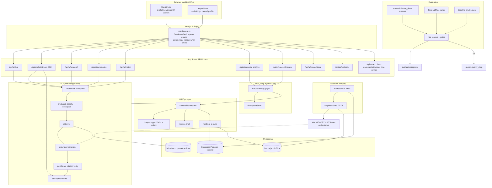

**Reading guide:** the top row is the user journey; the middle is the single-request pipeline; the bottom is the three cross-cutting systems that make every request *observable, measurable, correctable, improvable, reversible* (LLMOps north star).

---

## 1. The Closed Iteration Loop (Start Here)

This is the master diagram — every path a piece of information can travel, from raw upload to measured improvement:

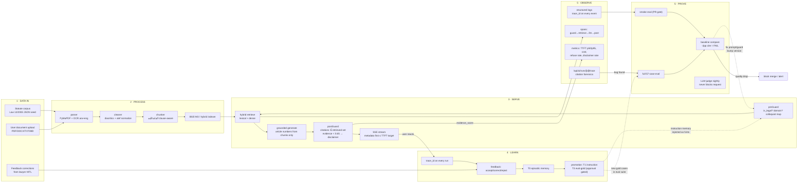

**The loop:** data lands → becomes retrievable knowledge → answers stream guarded → humans correct → corrections become memory + eval gold → suites catch regressions → versions bump → the next answer is better. Every arrow above is implemented; none is aspirational.

---

## 2. Data Upload → Knowledge (Ingestion Detail)

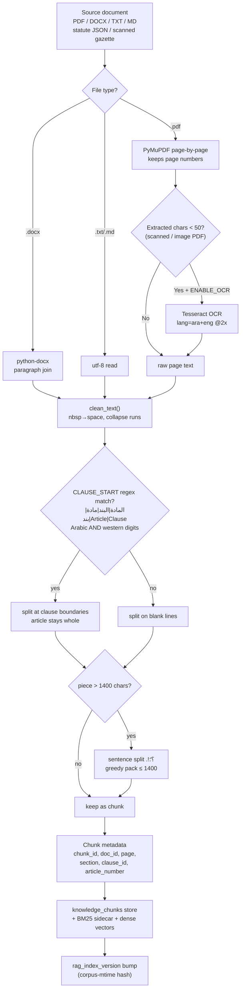

**Stage invariants (current implementation truth):**
| Stage | File | Guarantee | Known limit (filed TD) |
|---|---|---|---|
| Parse | `legalassist-ai/app/ingestion/parser.py` (sidecar) | page fidelity on PDF | DOCX loses pages |
| Clean | `cleaner.py` | normalized copy for search, **raw preserved for citations** | — |
| Chunk | `chunker.py` | article never split mid-sentence; `clause_id C####` sequential | article *number* not yet mapped from heading (TD family) |
| Index | `lib/ai/legalRag.ts` (offline path) | in-process TF-IDF/BM25 + normalization; zero network | single-node FAISS file scale (TD-12 pgvector ADR) |

**Offline mandate:** steps marked with the sidecar (`legalassist-ai`) run when `LEGAL_RAG_BASE_URL` is configured; otherwise `lib/ai/legalRag.ts` performs the entire hybrid search in-process over `lib/ai/knowledge/egyptian-labor-law.json` (46 articles) + `lib/data/legalData.ts` encyclopedia. Absence of Python/Ollama/Supabase/Groq never degrades the product.

---

## 3. chat_fast — Full Request Lifecycle (Sequence)

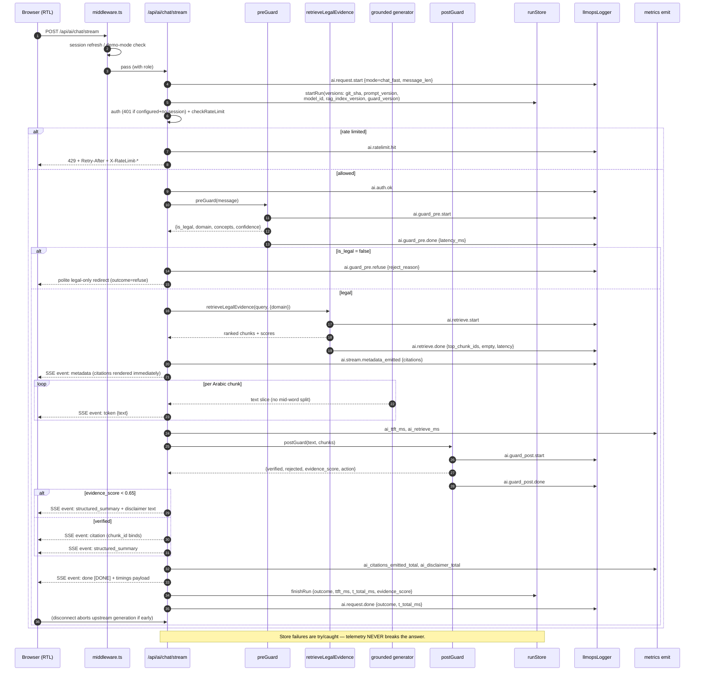

**Wire contract (verbatim):**
```
event: metadata   data: {"trace_id","domain","citations":[{law,article,chunk_id}]}
event: token      data: {"text":"وفقاً "}
event: citation   data: {"chunk_id","article_number","law_name"}
event: structured_summary  data: {"case_type","risk_level","recommended_action"}
event: done       data: [DONE] + {t_guard,t_retrieval,t_metadata_emit,ttft_ms,t_total}
```

**Stage thresholds:**
| Stage | Constant | File |
|---|---|---|
| Rate limit | 30/min per IP+user | `lib/ai/rateLimiter.ts` |
| Disclaimer trigger | evidence_score **< 0.65** | `legalGuard.postGuard` |
| TTFT warn / fail | > 800 ms warn, > 3000 ms hard fail (smoke gate) | `lib/llmops/eval/gates.ts` |
| Citation rule | every citation MUST exist in retrieved chunk metadata | `legalRag.verifyCitations` |

---

## 4. Hybrid Retrieval Internals

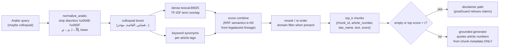

- **Index separation (spec §5.2):** public statutes corpus vs. client documents (tenant/case ACL) — a statute question is *never* answered solely from another client's docs.
- **Chunk metadata minimum** (spec-compliant): `chunk_id, doc_type, law_name, law_year, article_number, clause_label, page, raw_text, cleaned_text, language, ocr_used, ocr_confidence, content_hash, tenant_id`.

---

## 5. Legal Domain Guard — Decision Table

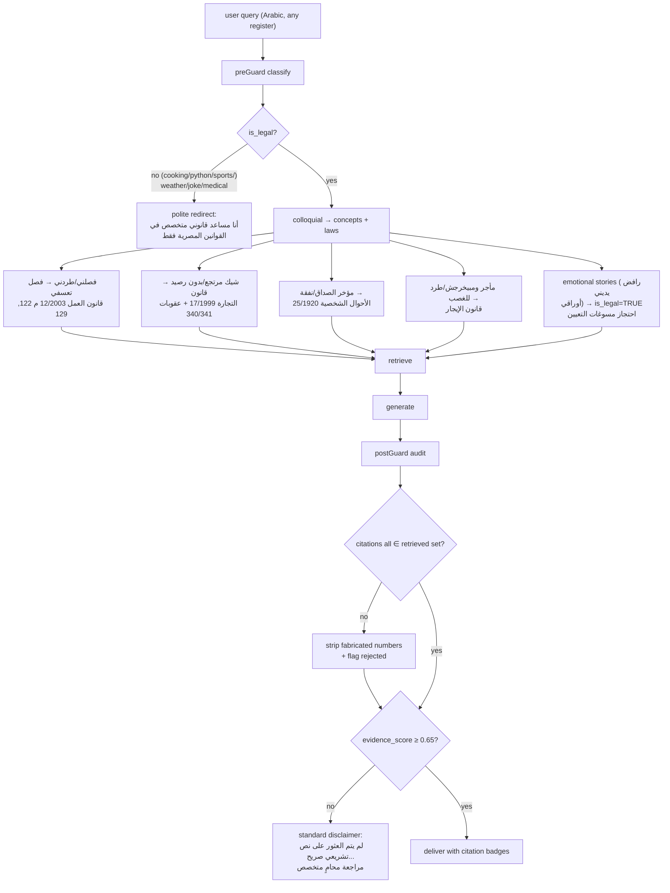

**Measured behavior (57-case grand suite):** guard precision **100%**, OOD block **100%**, emotional-legal false-reject **0**, disclaimer correctness **100%**.

---

## 6. case_deep — Multi-Agent HITL (Sequence)

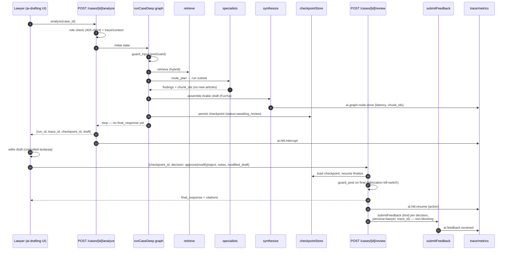

**HITL is a product invariant:** formal case briefs are never client-visible without lawyer approve/modify/reject. Rejecting HITL requires an explicit Accepted Risk entry.

---

## 7. Feedback Memory (LangMem) — Tiers and the No-Poison Wall

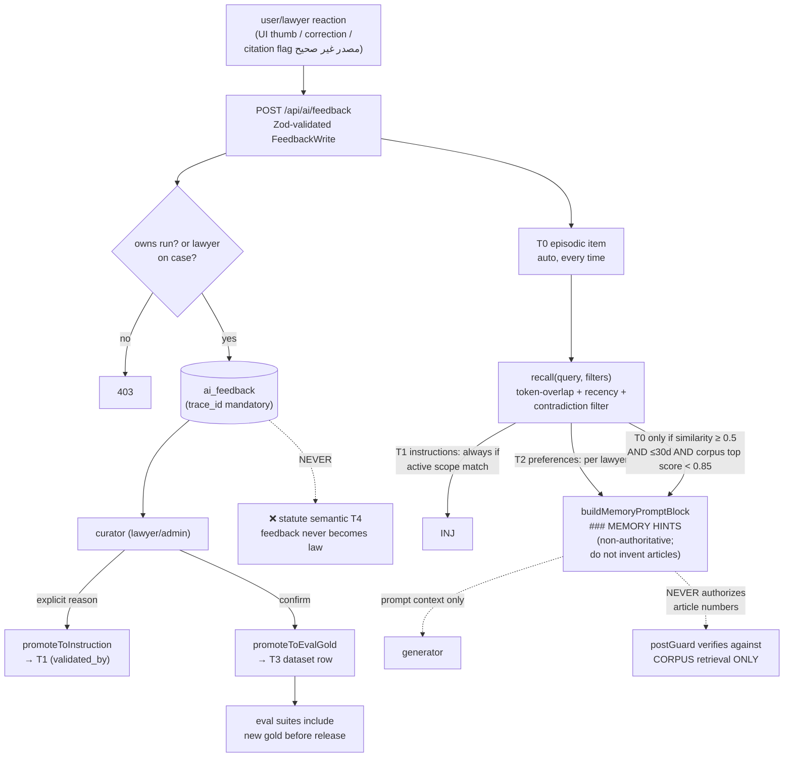

**Hard wall:** the only writers to statute-truth (T4 / corpus) are corpus ingestion and admin import. Feedback can improve *behavior* (T1/T2) and *evaluation* (T3) — it can never rewrite *law*.

---

## 8. Evaluation System — Suites → Scorers → Gates → Alerts

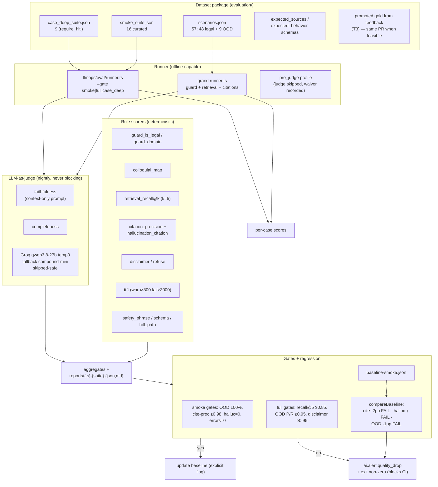

**Current measured aggregates (grand suite):** citation_verify_rate 1.00 · ood_block_rate 1.00 · guard_recall 1.00 · retrieval_recall@5 0.9853 · disclaimer_rate 1.00 · domain_accuracy 1.00 · 0 failures.

**Laws enforced:** "tests pass ≠ AI quality proven"; judge never replaces deterministic citation binding (L9); online judge never sits in the request path (L11).

---

## 9. Observability — How Any Answer Is Explained

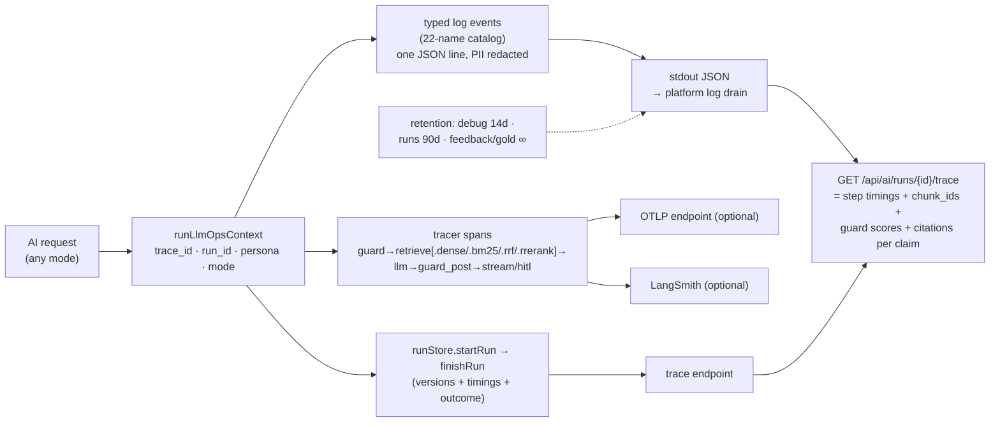

**Trace forensic invariant (L2):** every user-visible citation joins to retrieval `chunk_id`s; every AI request has a `trace_id` + terminal event (L1); every feedback row carries `trace_id` (L3).

**Retention:** debug payloads 7–14 d · aggregated metrics long · feedback + eval gold indefinite (product learning) · SQL policy shipped in `retention.ts` for service-role cron.

---

## 10. Versioned Artifacts — What Every Run Records

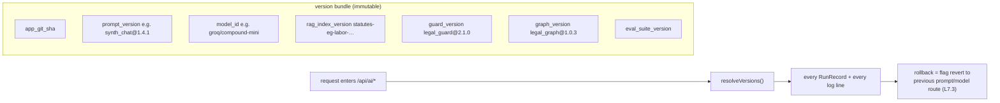

**Model routing (live Groq catalog):**

| Role | Primary | Fallback |
|---|---|---|
| classify_guard | `qwen/qwen3.8-27b` (t0) | `groq/compound-mini` |
| synthesize_chat | `groq/compound-mini` (t0.2) | `groq/compound` |
| synthesize_case | `groq/compound-mini` (t0.1) | `groq/compound` |
| judge_eval | `qwen/qwen3.8-27b` (t0) | `groq/compound-mini` |
| voice_tts *(future, non-chat)* | `canopylabs/orpheus-arabic-saudi` | — |

External providers are **optional adapters** — absence degrades to the offline deterministic path, never to an outage.

---

## 11. Quality Gates → CI → Release (Change Management)

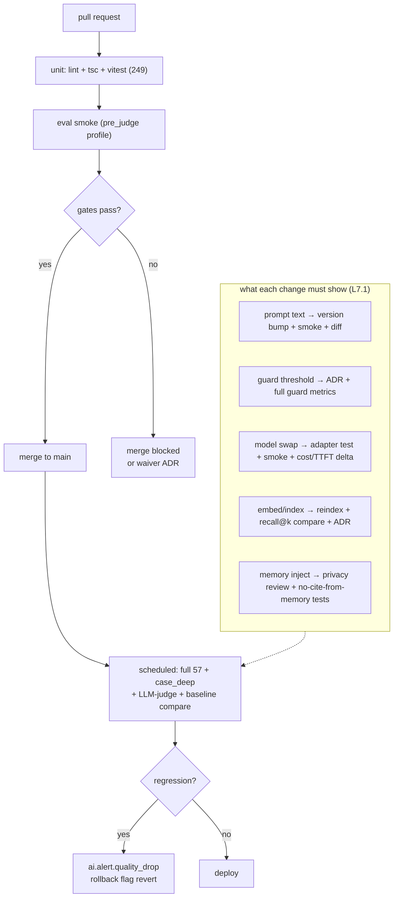

---

## 12. Final Observation Layer — Dashboards & Alerts (definitions live in `docs/llmops.md`)

| Panel | Source metric | Alert condition |
|---|---|---|
| TTFT p50 / p95 | `ai_ttft_ms` histogram | p95 > 3 s for 15 m |
| Cost / day | `ai_cost_usd_total` | > budget |
| Refuse rate | `ai_guard_refuse_total` | spike |
| Disclaimer rate | `ai_disclaimer_total` | spike (corpus gap signal) |
| Citation reject rate | `ai_citations_rejected_total` | spike (hallucination signal) |
| Feedback reject rate | `ai_feedback_total` | spike (quality drop) |
| Retrieve empty rate | `ai_retrieve_empty_total` | spike (index staleness) |
| HITL latency | graph timings | reviewer-bottleneck |
| Eval suite pass | `ai_eval_suite_pass{suite}` | smoke fail on main = page |

**End-to-end property this design guarantees:** every AI answer is *observable* (trace_id everywhere), *measurable* (rule scorers + judge), *correctable* (feedback with trace_id), *improvable* (memory + gold promotion + regression gates), and *reversible* (versioned prompts/models/indexes + flag rollback) — measured from the first uploaded byte to the last dashboard panel.
